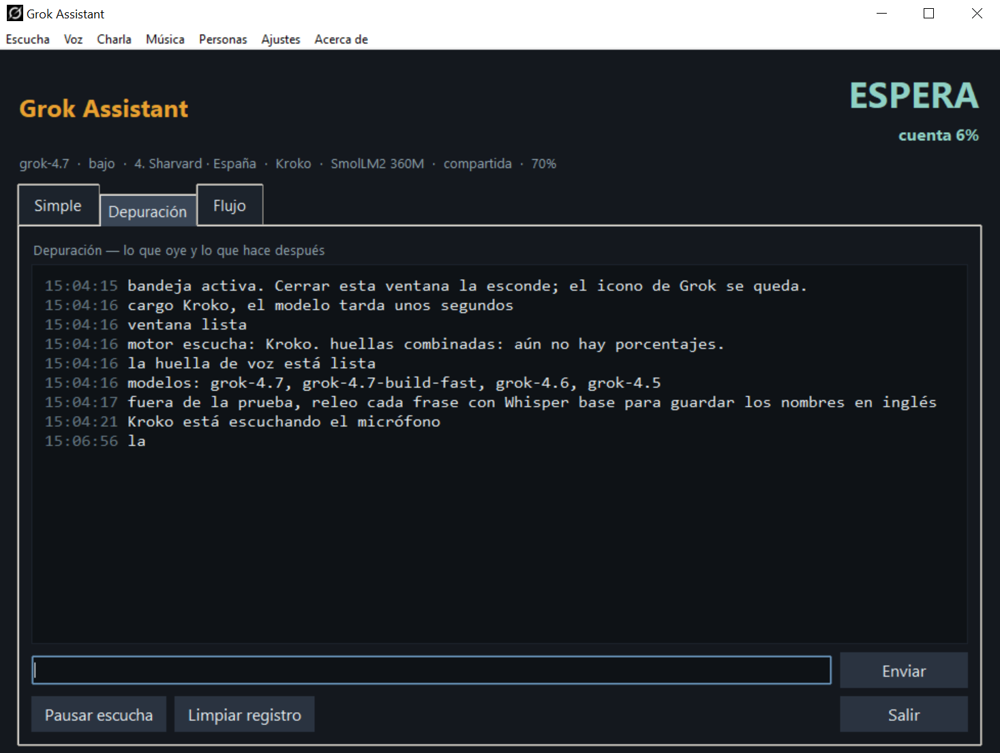
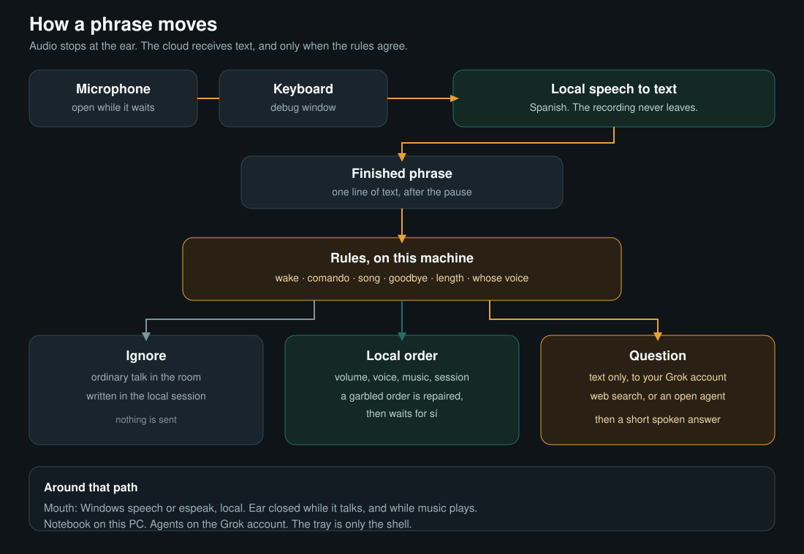

[Read in English](README.md) · [Leer en español](README.ES.md) · [Auf Deutsch lesen](README.DE.md)

# Grok Assistant

Version candidate 1.0.

J'ai attendu pendant des années que l'Amazon Echo apprenne vraiment à mieux écouter. Il est finalement resté surtout un haut-parleur avec un anneau lumineux, alors j'ai décidé de construire mon propre assistant pour une personne âgée qui a déjà un petit ordinateur portable à proximité.

Dans mon cas, cette personne est mon père. Sa vue est limitée et il passe de longues heures seul. Je voulais qu'il puisse simplement parler à une voix capable de répondre, de discuter et d'expliquer les choses, sans avoir à chercher un écran ni à lire de petits caractères. C'est désormais possible. Grok, sur cette machine, sert aussi de base aux fonctions et intégrations que j'ajouterai ensuite. Pour les familles un peu plus à l'aise techniquement et qui préfèrent ne pas laisser un ordinateur portable ouvert, je prépare le même assistant sur un Raspberry Pi 4 avec 4 Go de RAM. Je publierai également ce code afin que chacun puisse construire son propre appareil dédié.

Tant que le programme fonctionne, l'assistant peut rester à l'écoute. L'audio reste sur l'ordinateur et y est converti en texte. Grok ne reçoit du texte que lorsque l'assistant a réellement été sollicité : après un bonjour, pour une question, pour une commande commençant par `commande`, ou lorsqu'on demande une chanson. Les conversations ordinaires restent dans la session locale. Si une commande a été mal comprise, Grok peut aider à l'interpréter, mais l'assistant demande toujours confirmation avant de l'exécuter.

C'est l'idée générale. Ci-dessous, la fenêtre pendant l'écoute et le menu de l'icône, avec Escucha ouvert. Les images sont les mêmes dans chaque langue.

Le schéma ci-dessous montre ce qui arrive à une phrase à partir du moment où elle est prononcée.

Dans Réglages, Grok commence par le web seulement. Un administrateur peut lui permettre de modifier des fichiers. Le shell reste coupé, et un chemin relatif tombe dans le dossier de données de l'assistant.

## Lire la suite

- [Mode d'emploi](docs/fr/guide.md)
- [Aspect](docs/fr/aspect.md)
- [L'espagnol d'abord, parce qu'il a été développé et essayé d'abord en espagnol](docs/fr/ecoute.md)
- [Empreintes et oreilles](docs/fr/empreintes.md)
- [Sessions et agents](docs/fr/sessions.md)
- [Pourquoi Grok, et pas une autre fenêtre de chat](docs/fr/grok.md)
- [Ce qui tourne vraiment](docs/fr/pieces.md)
- [Ce qu'on peut dire](docs/fr/dire.md)
- [Lancer l'exécutable](docs/fr/lancer.md)
- [Le lancer depuis les sources](docs/fr/sources.md)
- [Ce que c'est](docs/fr/quoi.md)
