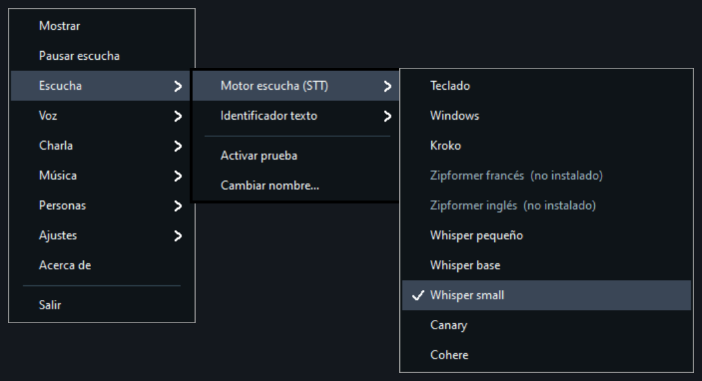

[Leer en español](README.ES.md) · [Lire en français](README.FR.md) · [Auf Deutsch lesen](README.DE.md)

# Grok Assistant

Version 0.1.0, still a release candidate.

This is a voice companion for the moments when reading is difficult and the house is quiet. The laptop version is for an older person who already has a small computer nearby. The Raspberry Pi 4 version, with 4 GB of RAM, is the same assistant as a dedicated device, for a family that would rather not leave a laptop open. I plan to publish that code soon. The microphone can stay ready. The audio stays on the computer. Only text that was meant for the assistant is sent out.

I spent years waiting for the Amazon Echo to become a better listener. It never really became more than a speaker with a light ring, so I decided to build my own.

In my case, that person is my father. His eyesight is limited, and he spends many hours on his own. I wanted him to have a voice he could simply talk to — one that could answer questions and explain things without making him find a screen or read small text. That is now possible. Grok on this machine is also the foundation for the features and integrations I plan to add next.

While the program is running, it can keep listening. Speech is turned into text on this computer. Grok only receives text when the assistant has actually been addressed: after a greeting, for a question, for a command beginning with `comando`, or when someone asks for a song. Ordinary conversation stays in the local session. If a command is unclear or misheard, Grok can help interpret it, but the assistant still asks for a `sí` before doing anything.

That is the basic idea. Below you can see the listening window and the tray menu with **Idioma** open.

The diagram below shows what happens to a spoken phrase from the moment it is heard.

## Read on

- [How to use it](docs/en/guide.md)
- [Spanish first, because it was developed and tested in Spanish first](docs/en/listening.md)
- [Voice prints and listeners](docs/en/prints.md)
- [Sessions and agents](docs/en/sessions.md)
- [Why Grok, and not another chat window](docs/en/why-grok.md)
- [What is actually running](docs/en/pieces.md)
- [What you can say](docs/en/saying.md)
- [Run the executable](docs/en/run.md)
- [Run it from the source tree](docs/en/source.md)
